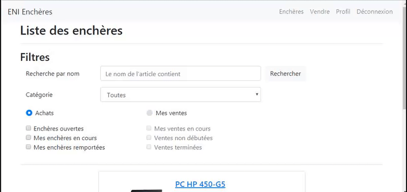

# ENI Java Auction Project
[](https://gitlab.com/AzzRun/eni-java-project-bid/commits/dev)
[](https://gitlab.com/AzzRun/eni-java-project-bid/commits/dev)
[](https://github.com/your/your-project/blob/master/LICENSE)

ENI Java Auction Project, a student projet to learn Java JEE development, whithout framework (Ex Spring).



# Getting Started
## From GIT
```shell
- git clone https://gitlab.com/AzzRun/eni-java-project-bid.git
- ant builddist
# Copy ${Project.dir}\dist\ENI-Encheres.war into Tomcat webapps installation folder
- start tomcat
```

## From Gitlab Artifacts/Release
```shell
- Download the artifacts/release from gitlab
# Copy ${Project.dir}\dist\ENI-Encheres.war into Tomcat webapps installation folder
- start tomcat
```

## Prerequisites
What is needed to set up the dev environment. For instance, global dependencies or any other tools. include download links.
- Java JDK & JRE ~+8 
- Apache Tomcat ~+8.5.39
- Projet librairies
- Eclipse Oxygen.3a Release (4.7.3a) ~+

## Running the tests (Junit tests)
```shell
ant test
```


## Exemple
### Get an DAO entity
```java
IDAOEnchere EnchereDAO = AbstractDAOFactory.getFactory().getEnchereDAO();
```


Built With
Apache ant - for automating software build processes

Contributing
Please read CONTRIBUTING.md for details on our code of conduct, and the process for submitting pull requests to us.

Versioning
We use GIT for versioning. For the versions available, see the tags on this repository.

## Team

| <a href="http://github.com/azzrun" target="_blank">**Quentin Martinez @AzzRun**</a> | <a href="https://gitlab.com/fbnctn" target="_blank">**Fabien Catin @fbnctn**</a> | <a href="https://gitlab.com/ApoZLd" target="_blank">**Romain @ApoZLd**</a> |
| :---: |:---:| :---:|
| [](http://azrunsoft.com)    | [](https://gitlab.com/fbnctn) | [](https://gitlab.com/ApoZLd)  |
| <a href="http://github.com/azzrun" target="_blank">`github.com/azzrun`</a> | <a href="https://gitlab.com/fbnctn" target="_blank">`gitlab.com/fbnctn`</a> | <a href="https://gitlab.com/ApoZLd" target="_blank">`gitlab.com/ApoZLd`</a> |


License
This project is licensed under the MIT License - see the LICENSE.md file for details

Acknowledgments
Hat tip to anyone whose code was used
Inspiration
etc